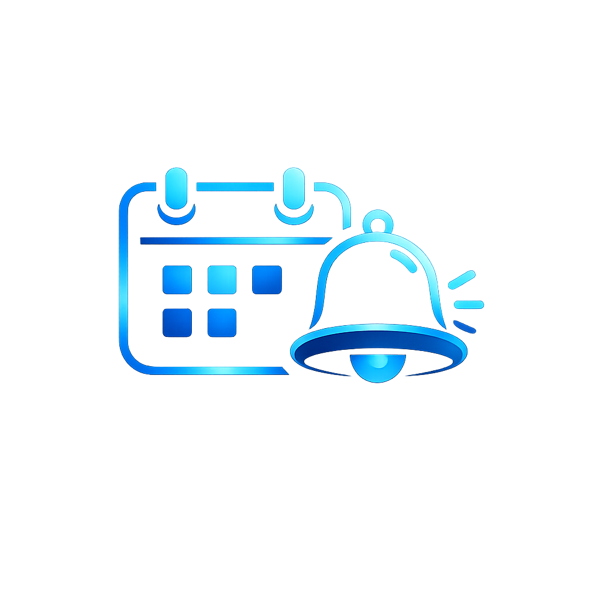

<div align="center">



# Engage

**Your personal weekly watch schedule, right inside Kodi.**

*"Voyager on Thursday. TNG on Saturday. Movie night on Friday."*

Engage quietly waits in the background and, just before each show is due, slides a
slim banner across the top of the screen, with the **next unwatched episode**
already worked out and a live countdown ticking down. One tap and you're watching.

</div>

---

## Why you'll like it

You've got shows you mean to keep up with, but "what was I up to on Voyager
again?" gets in the way. Engage turns *"I should watch something tonight"* into a
gentle, automatic nudge at the right time, and it always knows the exact next
episode you haven't seen.

No streaming service required, no accounts, no cloud. It just uses your Kodi
Favourites and library.

## Features

- 🗓️ **Unlimited watch slots**, schedule any favourite (TV show, movie, folder,
  playlist) on chosen day(s) and a time, weekly or as a one-off date.
- 📅 **Multiple days per slot**, pick any combination of weekdays (great for a
  show that's stripped daily, e.g. the Simpsons every weekday at 6).
- 🎞️ **Movie sequences**, build an ordered list of films (e.g. all the Marvel
  movies); each scheduled showing plays the next one you haven't watched.
- 🦸 **Binge / crossover orders**, weave episodes from several shows into one
  hand-built order (Arrow S3E1 to 3, then Flash S1E1 to 4, then back to Arrow) for
  interlinked series like the Arrowverse. Plays the next unwatched in your order.
- 📺 **Knows the next episode**, for TV shows it resolves the exact next
  *unwatched* episode (and skips season-0 specials until the main run is done).
  Plays it as a proper library/plugin item, so metadata and watched-tracking
  just work.
- ⏱️ **Slim countdown banner**, slides down from the top with the show's
  **poster**, the show/episode, and a live countdown. Stays out of your way.
- 🎬 **One-tap actions**:
  - **Start Now**, play immediately.
  - **Snooze**, 5 / 10 / 15 / 30 / 60 minutes, then it asks again.
  - **Queue Next**, finish what you're watching, then play the slot.
  - **Stop & Resume After**, stop now, play the slot, then **resume what you
    were watching** from where you left off.
  - **Cancel**, skip this one.
- ⏳ **You decide what happens if you ignore it**, each slot picks what the
  countdown does when it reaches zero: **queue it** for when your current show
  finishes (the default), **start it now**, **stop and resume after**, or
  **do nothing** and let it pass.
- 🌙 **Catch-up window**, had Kodi switched off when a show was due? Turn it on
  within a configurable window (up to 12 h) and Engage still prompts you. Leave
  it off for a week and it stays quiet, no pile-up of stale prompts.
- 🗂️ **Friendly slot manager**, add, edit, duplicate and delete slots through
  simple on-screen menus that work perfectly with a remote. No fiddly keypads.
- 💾 **Backup & Restore**, save all your slots and settings to a JSON file and
  restore them on any box. Perfect for moving to a new media centre.

## Install

1. Download the latest `service.engage-x.y.z.zip` from the
   [**Releases**](../../releases) page.
2. In Kodi: **Settings → System → Add-ons → Unknown sources** (enable it).
3. **Add-ons → Install from zip file** → pick the downloaded zip.
4. That's it, Engage starts automatically and runs every time Kodi launches.

> Upgrading? Installing a newer zip replaces the old one. Your slots and settings
> are kept safe in `userdata` and carry over untouched.

## Getting started

Open Engage from **Add-ons → Program add-ons → Engage** (or **Services → Engage →
Configure**) and choose **Manage slots…**

1. **+ Add new slot…**
2. Pick a favourite, a day, and a time. Done.

> **Tip:** the thing you want to watch must be in **Kodi Favourites** first
> (Engage finds it by name). For a TV show, favourite the show itself, Engage
> figures out the next episode for you.

### Settings (General)

| Setting | What it does |
|---|---|
| **Poll interval** | How often the scheduler checks, in seconds |
| **Catch-up window** | Hours after a missed slot it will still prompt you (0 = off) |
| **Max missed-slot banners** | How many times an overdue banner reappears before giving up |
| **Show all favourites in pickers** | Off = only video/TV favourites are listed |
| **Debug logging** | Verbose logging to `kodi.log` for troubleshooting |
| **Test mode** | Fire all enabled slots immediately (handy for testing) |

## For developers

`build-zip.ps1` reads the version from `VERSION` (kept in sync with
`service.engage/addon.xml`) and produces an installable zip in `Engage Dist/`
(with forward-slash paths so Kodi accepts it), a source zip in `Engage Git/`,
and a runnable copy of the add-on in `Engage App/`.

```
service.engage/
├─ addon.xml              add-on manifest (service + program/script)
├─ service.py             service entry point
├─ script.py              launcher menu + action dispatcher
└─ resources/
   ├─ settings.xml        General settings
   ├─ lib/
   │  ├─ scheduler.py     polling loop, episode resolution, playback, resume
   │  ├─ prompt.py        the countdown banner (WindowXMLDialog)
   │  ├─ slots.py         JSON slot store + backup/restore
   │  ├─ slot_manager.py  dialog-driven slot management UI
   │  └─ favourites_ui.py favourites picker / add / remove
   └─ skins/Default/      banner skin + textures
```

## License

[GPL-2.0-or-later](LICENSE)
